<div align="center">


# Hyprland Dotfiles

*A minimal, professional, and fully customizable Hyprland configuration*

</div>

## Showcase

<div align="center">

<https://github.com/vyrx-dev/dotfiles/assets/showcase.mp4>

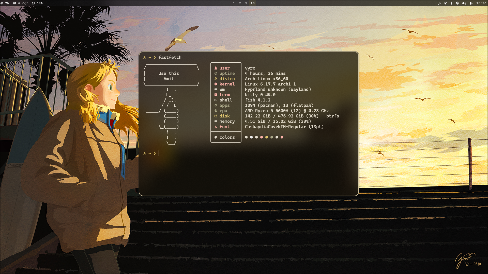

</div>

---

## Features

- **Matugen-powered theming** — Automated color scheme generation from wallpapers
- **Modular configuration** — Clean, organized, and easy to customize
- **Comprehensive tooling** — Waybar, Rofi, Swaync, Wlogout, Hyprlock, and more
- **Neovim & Tmux** — Fully integrated development environment
- **GNU Stow** — Simple and efficient dotfile management

---

## Components

<details>
<summary><b>Rofi Menus</b></summary>

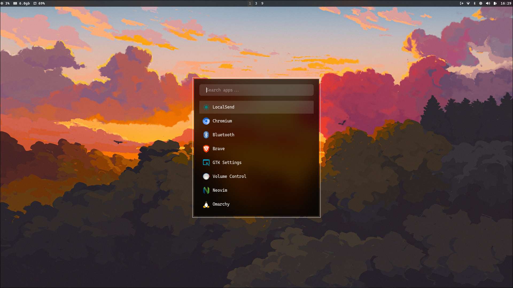

<https://github.com/vyrx-dev/dotfiles/assets/rofi.mp4>

### Emoji Picker

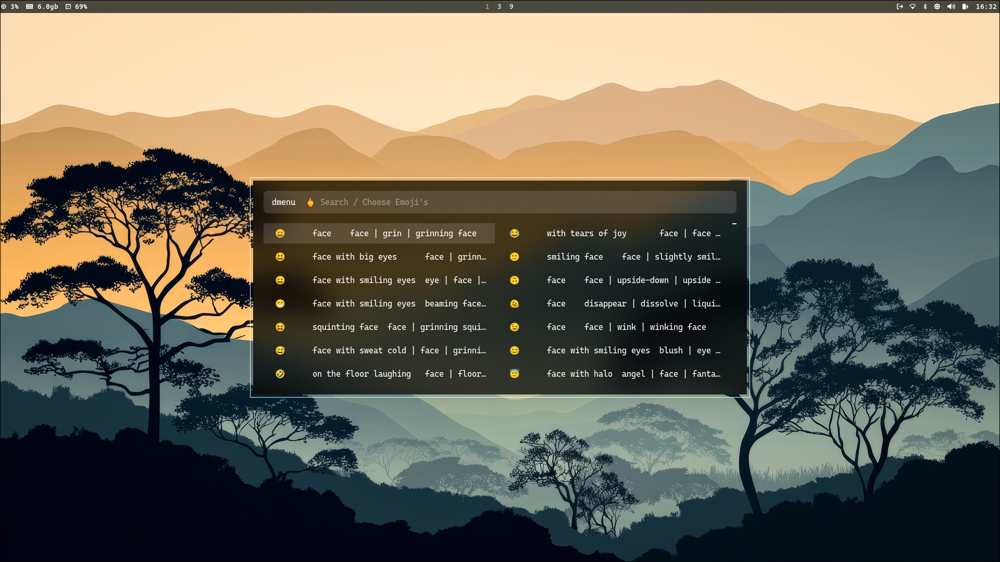

### Clipboard Manager

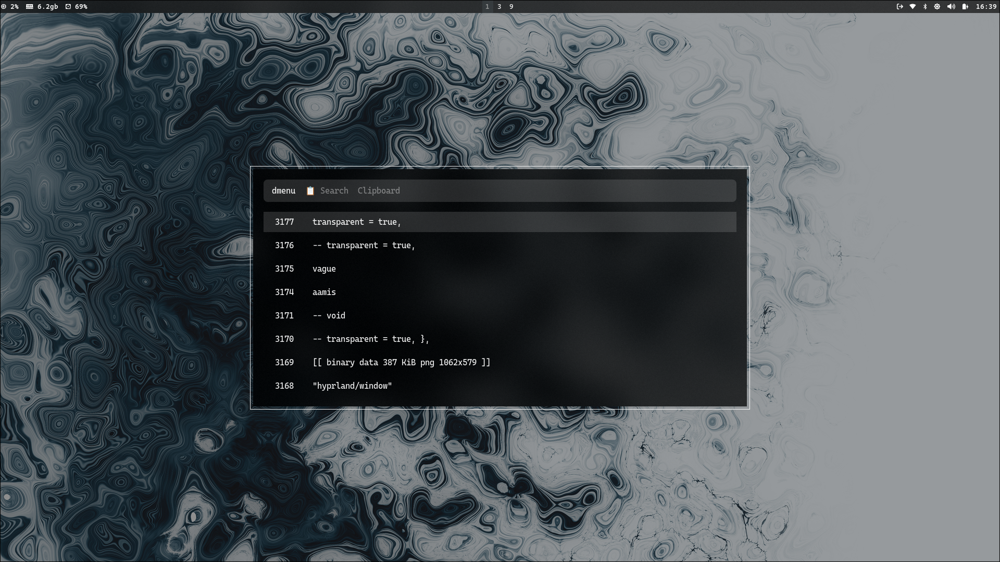

### Wallpaper Selector

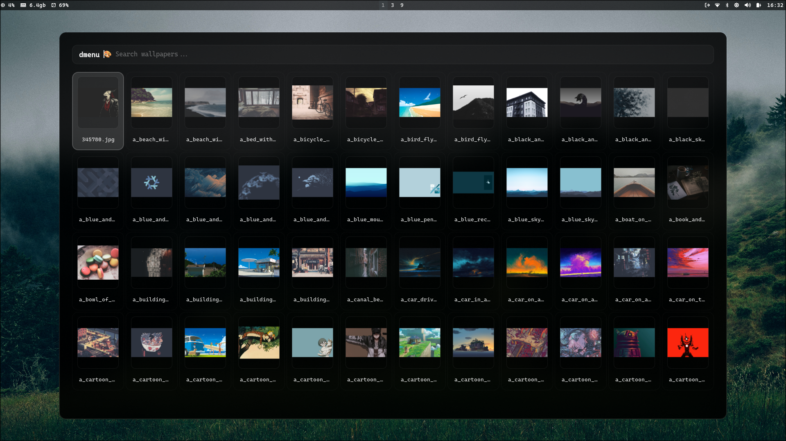

### Power Profile Manager

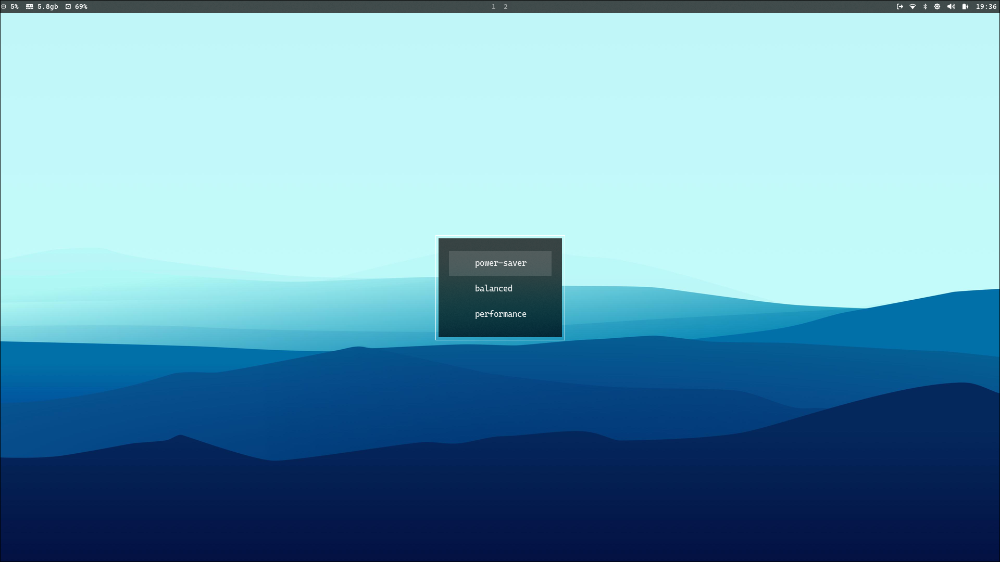

</details>

<details>
<summary><b>Matugen Theming</b></summary>

<https://github.com/vyrx-dev/dotfiles/assets/matugen.mp4>

</details>

<details>
<summary><b>Notification Center (Swaync)</b></summary>

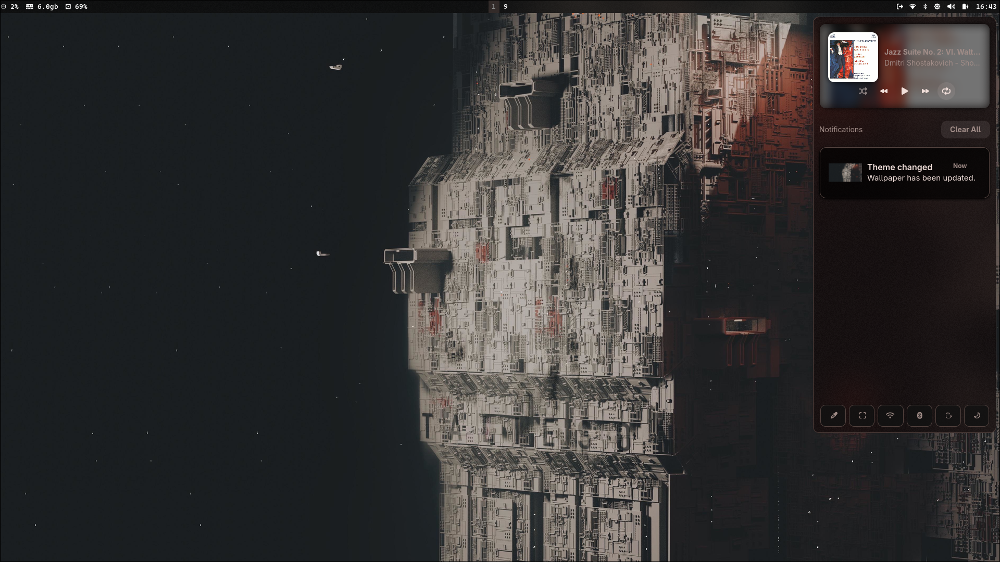
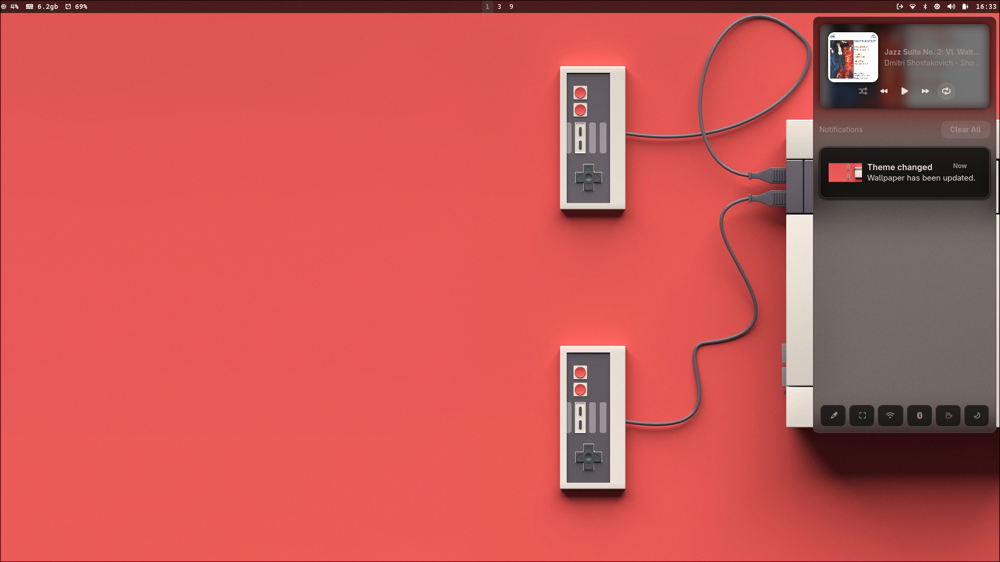
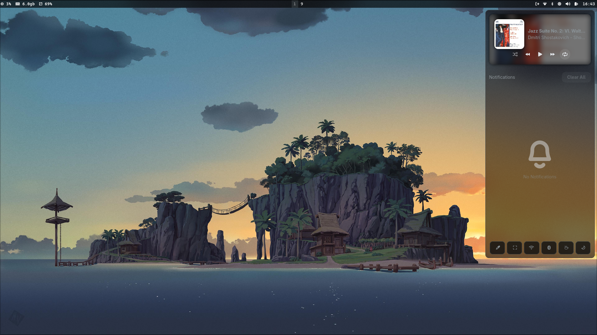

</details>

<details>
<summary><b>Neovim & Tmux</b></summary>

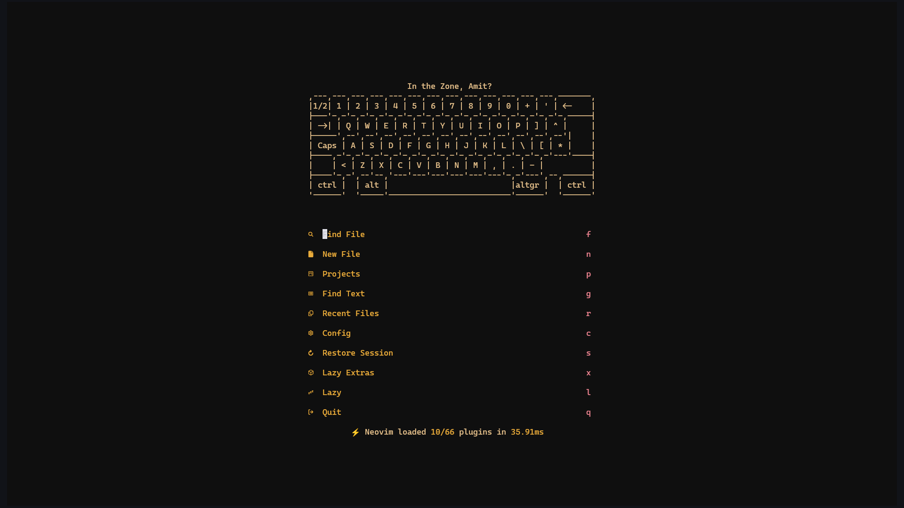
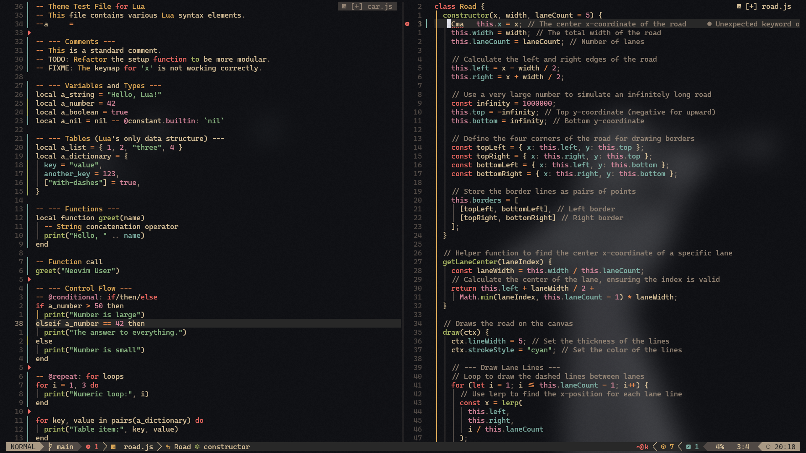
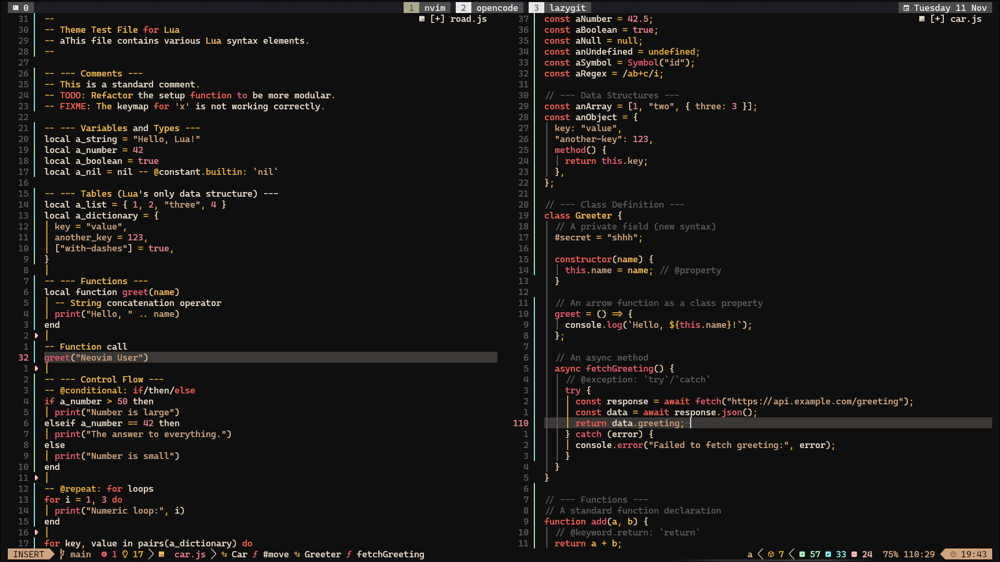

</details>

<details>
<summary><b>Music (RMPC)</b></summary>

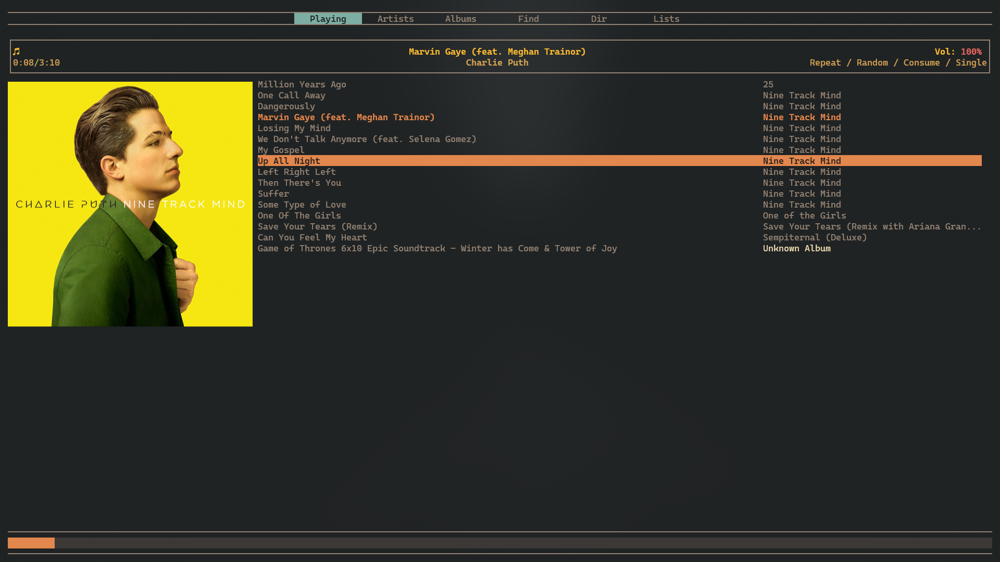

</details>

<details>
<summary><b>Wlogout</b></summary>

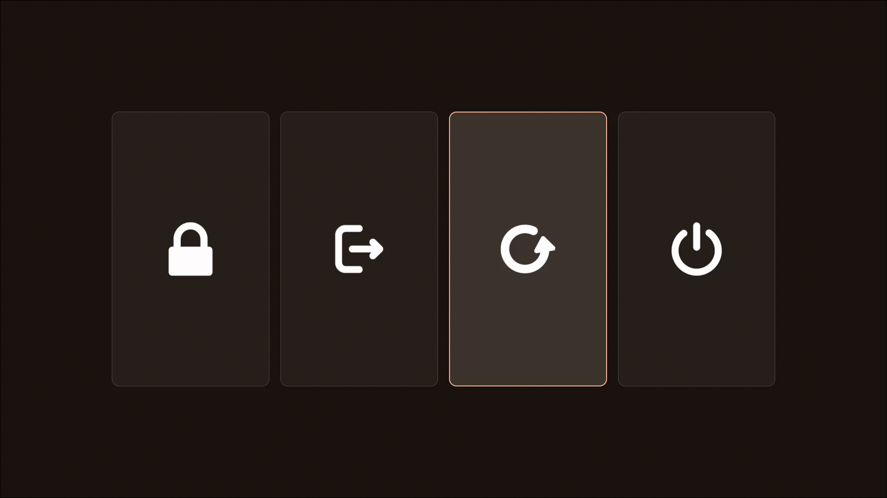

</details>

<details>
<summary><b>Hyprlock</b></summary>

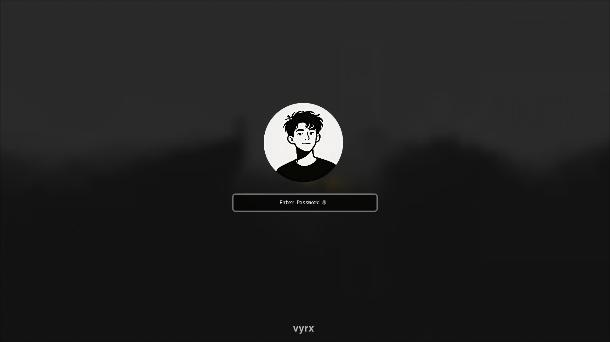

</details>

---

## Installation

### Prerequisites

```bash
# Core dependencies
sudo pacman -S stow git base-devel

# Hyprland & Wayland
sudo pacman -S hyprland xdg-desktop-portal-hyprland

# System utilities
sudo pacman -S waybar rofi swaync swww hypridle hyprlock wlogout
sudo pacman -S polkit-gnome cliphist wl-clipboard

# Terminal & Shell
sudo pacman -S kitty alacritty fish starship tmux

# Development
sudo pacman -S neovim lazygit btop yazi

# Audio & Media
sudo pacman -S pipewire wireplumber pavucontrol mpd mpc ncmpcpp

# Theming
sudo pacman -S matugen pywalfox

# Additional tools
sudo pacman -S fastfetch jq fd ripgrep fzf swayosd
```

### Clone & Install

```bash
# Clone the repository
git clone https://github.com/vyrx-dev/dotfiles.git ~/dotfiles

# Navigate to the directory
cd ~/dotfiles

# Create symlinks using GNU Stow
stow .
```

### Post-Installation

After running `stow .`, all configuration files will be symlinked to their appropriate locations in `~/.config/`.

If you want to uninstall:

```bash
cd ~/dotfiles
stow -D .
```

---

## Tools Included

| Tool | Description |
|------|-------------|
| **Hyprland** | Dynamic tiling Wayland compositor |
| **Waybar** | Highly customizable status bar |
| **Rofi** | Application launcher and menu system |
| **Swaync** | Notification daemon with control center |
| **Kitty** | GPU-accelerated terminal emulator |
| **Alacritty** | Fast, cross-platform terminal emulator |
| **Neovim** | Hyperextensible Vim-based text editor |
| **Tmux** | Terminal multiplexer |
| **Fish** | Smart and user-friendly shell |
| **Starship** | Minimal, fast, and customizable prompt |
| **Lazygit** | Simple terminal UI for git commands |
| **Matugen** | Material Design color scheme generator |
| **RMPC** | Rusty Music Player Client for MPD |

---

## Keyboard Shortcuts

### Applications

| Keybind | Action |
|---------|--------|
| `Super + Return` | Terminal (Kitty) |
| `Super + B` | Browser |
| `Super + E` | File Manager (Nautilus) |
| `Super + M` | Music (Spotify) |
| `Super + D` | Discord |
| `Super + O` | Obsidian |
| `Super + C` | VS Code |

### Rofi Menus

| Keybind | Action |
|---------|--------|
| `Super + Space` | Application Launcher |
| `Alt + ,` | Clipboard Manager |
| `Alt + .` | Emoji Picker |
| `Super + Ctrl + B` | Power Profiles |
| `Super + Ctrl + Space` | Theme Selector (Matugen) |
| `Super + Alt + Space` | Wallpaper Picker |

### Window Management

| Keybind | Action |
|---------|--------|
| `Super + Q` | Close Window |
| `Super + K` | Kill Application |
| `Super + Shift + O` | Pop Window (Float & Pin) |

### System

| Keybind | Action |
|---------|--------|
| `Super + L` | Lock Screen (Hyprlock) |
| `Super + Escape` | Wlogout Menu |
| `Super + N` | Notification Center |
| `Alt + /` | System Monitor (btop) |

### Screenshots & Recording

| Keybind | Action |
|---------|--------|
| `Super + P` | Screenshot Region |
| `Super + R` | Screen Record (System Audio) |
| `Super + Alt + R` | Screen Record (System + Mic) |
| `Super + Shift + P` | Color Picker |

### Tmux Sessions

| Keybind | Action |
|---------|--------|
| `Super + Shift + Return` | Attach Tmux Session |
| `Super + Alt + Return` | New Tmux Session |

*For complete keybindings, see [.config/hypr/bindings.conf](.config/hypr/bindings.conf)*

---

## Configuration Structure

```
.config/
├── hypr/           # Hyprland configuration
├── waybar/         # Status bar
├── rofi/           # Launchers and menus
├── swaync/         # Notification center
├── kitty/          # Terminal (Kitty)
├── alacritty/      # Terminal (Alacritty)
├── nvim/           # Neovim configuration
├── tmux/           # Tmux configuration
├── fish/           # Fish shell
├── matugen/        # Theme generator
└── starship.toml   # Shell prompt
```

---

## TODO

- [ ] **Theme Switcher** — Implement dynamic theme switching interface
- [ ] **Spicetify Pywal Integration** — Add Spotify theming support

---

<div align="center">

**If you found this useful, consider giving it a ⭐**

Made with ❤️ for the Hyprland community

</div>
