<div align="center">


**A minimal, productivity-focused Arch + Hyprland setup**

<a href="#installation"></a>&ensp;
<a href="#themes"></a>&ensp;
<a href="install/themes/README.md"></a>&ensp;
<a href="#usage"></a>&ensp;
<a href="#keybindings"></a>

</div>

## Showcase

 https://github.com/user-attachments/assets/8f59ff8d-90ab-4a0c-a2d6-9346307f5de1

---

## Features

- **One-command theming** — Switch entire desktop look with `symphony switch`
- **Dynamic colors** — Matugen extracts palette from any wallpaper
- **11 handcrafted themes** — Dark, cozy, and aesthetic
- **Everything synced** — Terminal, bar, launcher, notifications, apps
- **Rofi menus** — App launcher, emoji picker, clipboard, wallpaper selector, power profiles
- **Dual mode** — Vibe (animations + blur) or Focus (minimal + fast)
- **Music integration** — MPD + RMPC + Cava visualizer

<details>
<summary><b>Dual Mode System</b></summary>

Sometimes you want your desktop to look good. Other times you just need to get work done.

**Vibe Mode**

The default look — animations, blur, transparency, gaps. Makes everything feel smooth and polished.

**Focus Mode**

Strips it all down. No animations, minimal borders, transparency off. Just you and your work.

Toggle between them with `Super + Ctrl + Backspace`

</details>

---

## Themes

<table>
<tr>
<td align="center">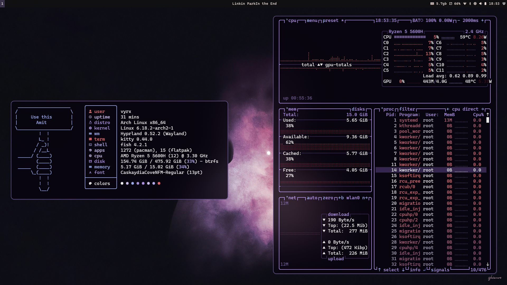<br><b>Void</b></td>
<td align="center">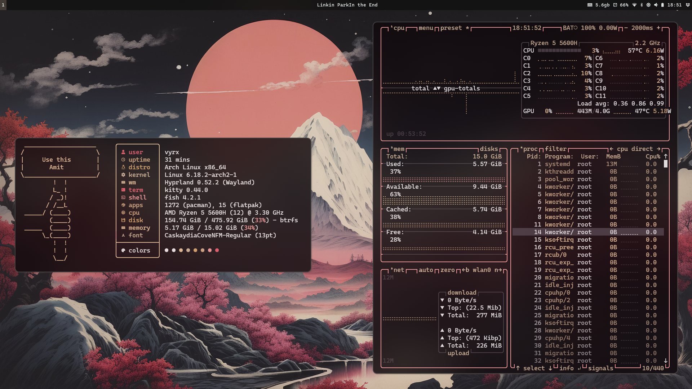<br><b>Sakura</b></td>
</tr>
<tr>
<td align="center">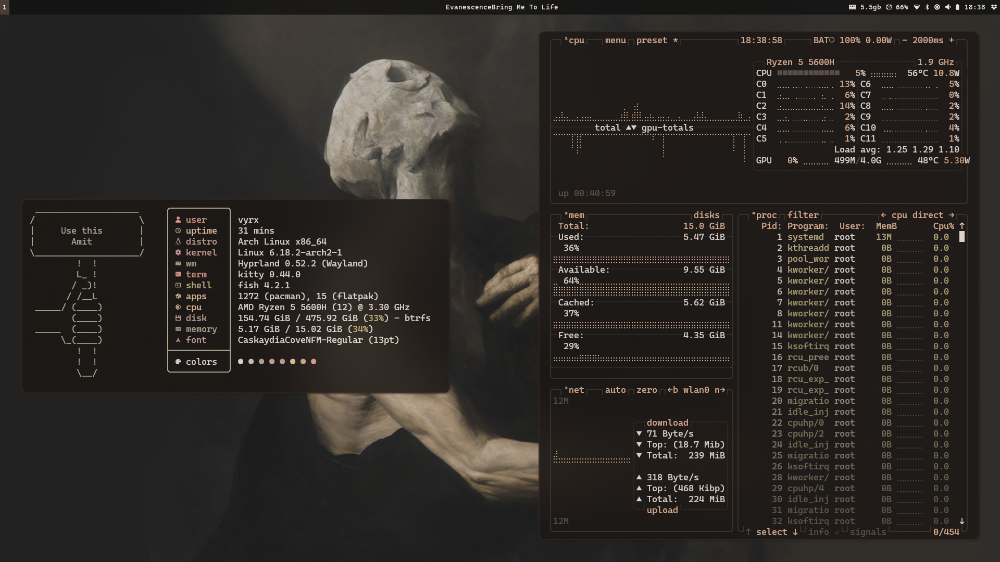<br><b>Espresso</b></td>
<td align="center">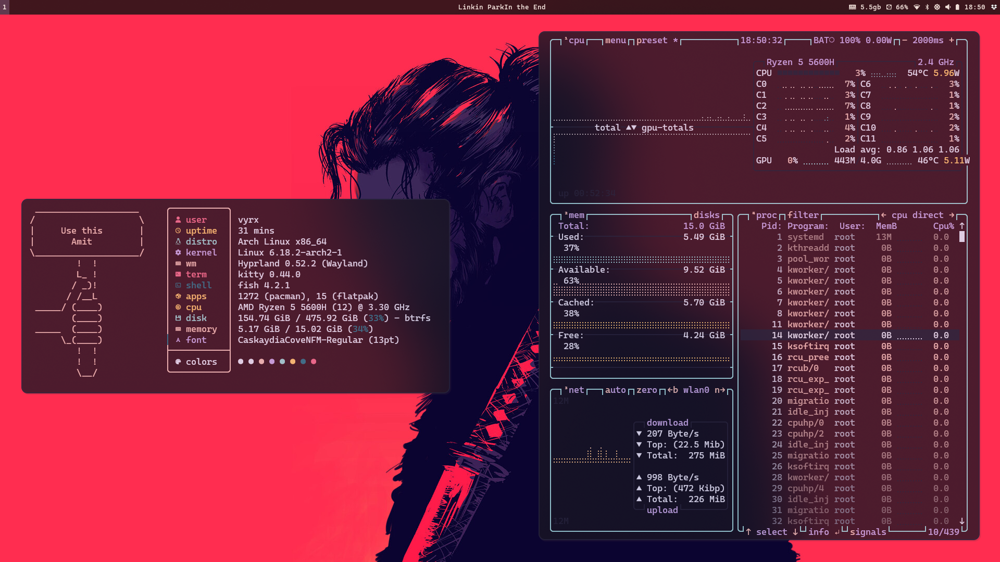<br><b>Rosé Pine</b></td>
</tr>
<tr>
<td align="center">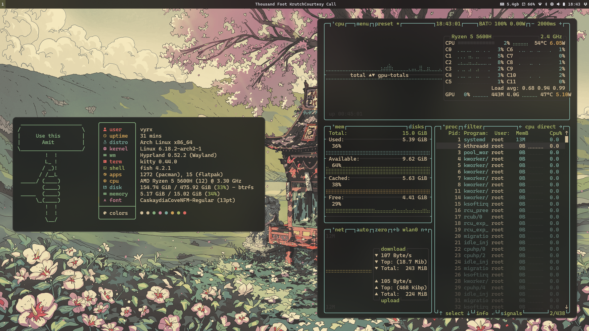<br><b>Gruvbox Material</b></td>
<td align="center">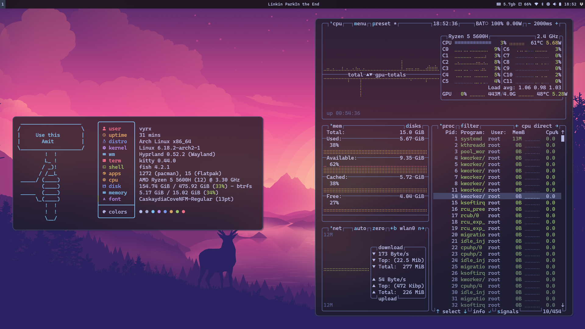<br><b>Tokyo Night</b></td>
</tr>
<tr>
<td align="center">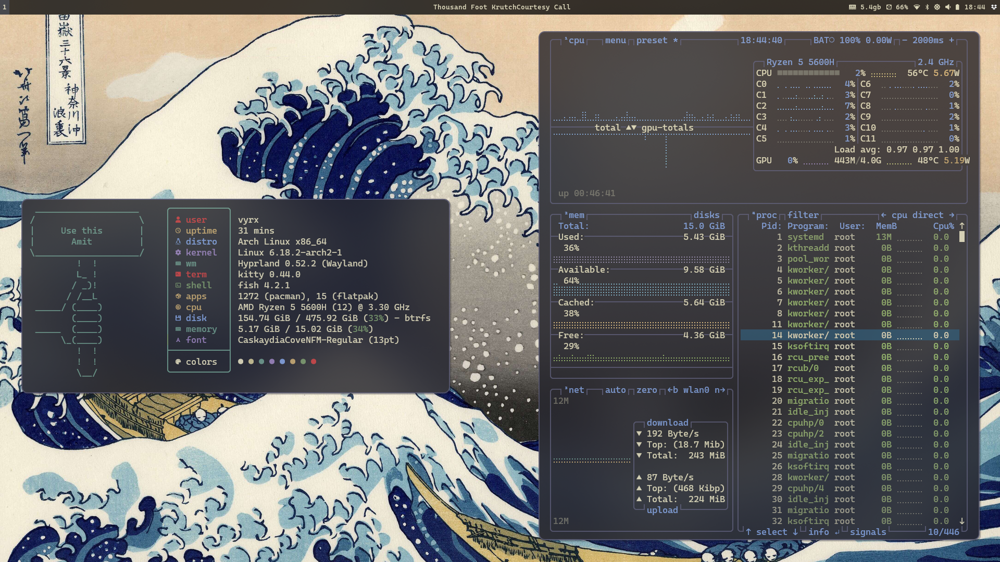<br><b>Kanagawa</b></td>
<td align="center">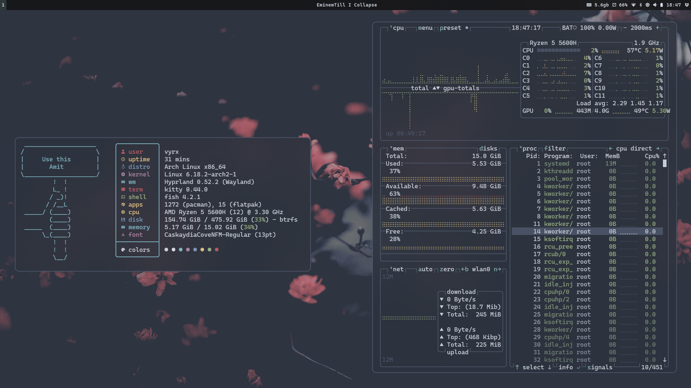<br><b>Nordic</b></td>
</tr>
<tr>
<td align="center">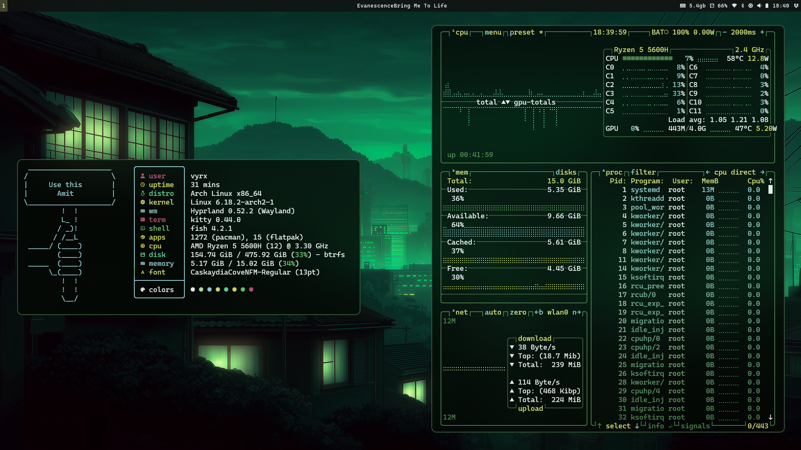<br><b>Forest</b></td>
<td align="center">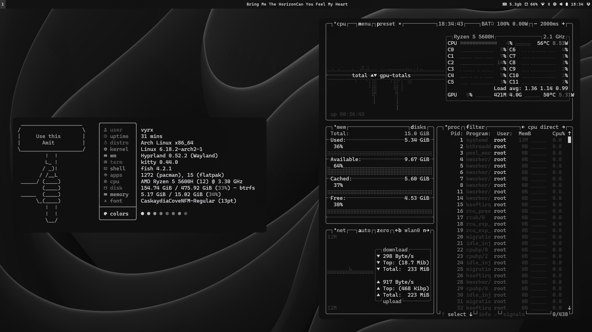<br><b>Zen</b></td>
</tr>
</table>

<div align="center">

### Dynamic Theme


_Colors generated from wallpaper using Matugen_

</div>

---

## Rofi & Notifications

<div align="center">


</div>

<details>
<summary><b>Rofi Menus</b></summary>

<div align="center">

**Wallpaper Selector**

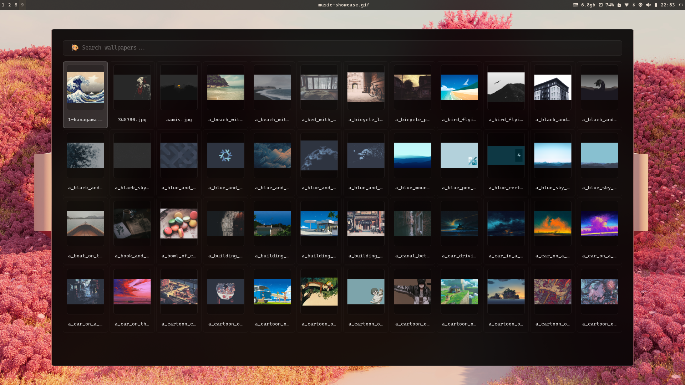

**Music**

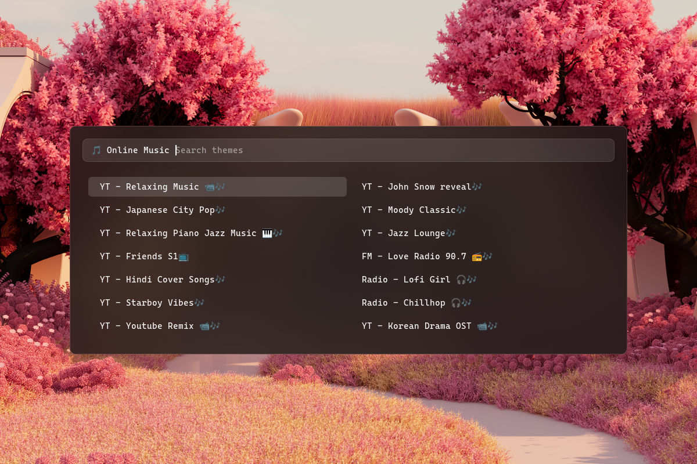

|             App Launcher             |              Emoji Picker              |                Power Menu                 |
| :----------------------------------: | :------------------------------------: | :---------------------------------------: |
| 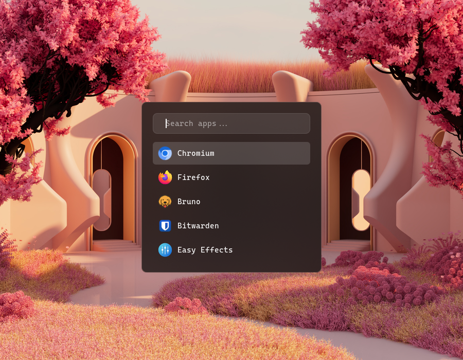 | 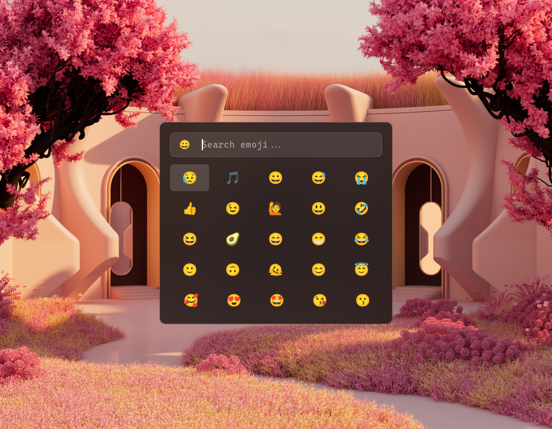 | 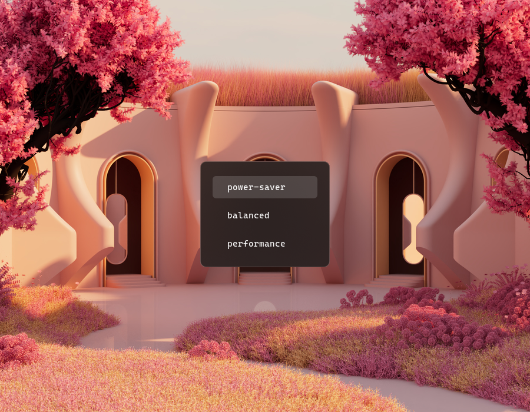 |

</div>

</details>

---

## Hyprlock

<div align="center">

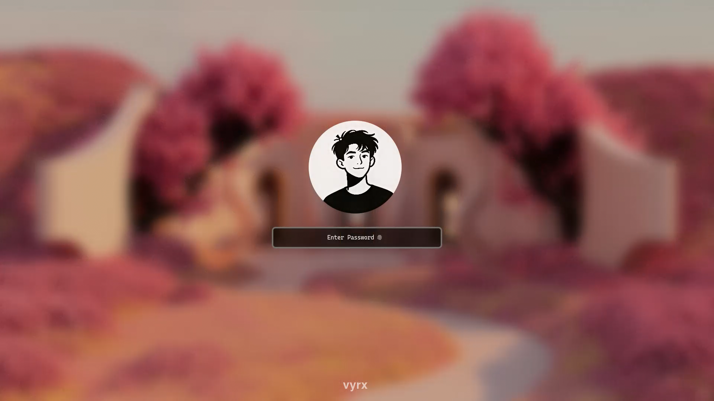

</div>

---

## Neovim

<div align="center">


</div>

---

## Music

<div align="center">


_RMPC + Cava visualizer_

</div>

---

## Installation

```bash
curl -fsSL https://raw.githubusercontent.com/vyrx-dev/symphony/main/boot.sh | bash
```

Or manually:

```bash
git clone https://github.com/vyrx-dev/symphony ~/symphony
cd ~/symphony && ./install.sh
```

### Themes Only

Want just the themes without the full setup? See [install/themes/README.md](install/themes/README.md)

---

## Usage

### Theme Switching

```bash
symphony switch          # interactive picker
symphony switch sakura   # direct switch
symphony switch --random # random theme
symphony list            # show all themes
symphony reload          # re-apply current
```

Or press `Super + Ctrl + Shift + Space` for the theme picker.

<a id="keybindings"></a>

### Keybindings

<details>
<summary><b>Applications</b></summary>

| Key              | Action       |
| ---------------- | ------------ |
| `Super + Return` | Terminal     |
| `Super + B`      | Browser      |
| `Super + E`      | File Manager |
| `Super + M`      | Spotify      |
| `Super + D`      | Discord      |
| `Super + O`      | Obsidian     |
| `Super + C`      | VS Code      |
| `Alt + M`        | RMPC         |
| `Alt + N`        | Neovim       |
| `Alt + Q`        | Yazi         |
| `Alt + /`        | Btop         |

</details>

<details>
<summary><b>Rofi Menus</b></summary>

| Key                            | Action           |
| ------------------------------ | ---------------- |
| `Super + Space`                | App Launcher     |
| `Alt + ,`                      | Clipboard        |
| `Alt + .`                      | Emoji Picker     |
| `Super + Ctrl + B`             | Power Profiles   |
| `Super + Ctrl + Space`         | Matugen Theme    |
| `Super + Alt + Space`          | Wallpaper Picker |
| `Super + Ctrl + Shift + Space` | Theme Switcher   |

</details>

<details>
<summary><b>Window Management</b></summary>

| Key                     | Action                   |
| ----------------------- | ------------------------ |
| `Super + Q`             | Close Window             |
| `Super + K`             | Kill Application         |
| `Super + Arrow`         | Move Focus               |
| `Super + Shift + Arrow` | Move Window              |
| `Super + Ctrl + Arrow`  | Resize Window            |
| `Super + 1-9`           | Switch Workspace         |
| `Super + Shift + 1-9`   | Move to Workspace        |
| `Super + F`             | Fullscreen               |
| `Super + V`             | Toggle Floating          |
| `Super + Shift + O`     | Pop Window (Float & Pin) |

</details>

<details>
<summary><b>System</b></summary>

| Key                        | Action                 |
| -------------------------- | ---------------------- |
| `Super + Shift + L`        | Lock Screen            |
| `Super + Escape`           | Power Menu             |
| `Super + N`                | Notifications          |
| `Super + Backspace`        | Toggle Transparency    |
| `Super + Ctrl + Backspace` | Toggle Focus/Vibe Mode |

</details>

<details>
<summary><b>Screenshots & Recording</b></summary>

| Key                 | Action          |
| ------------------- | --------------- |
| `Super + P`         | Screenshot      |
| `Super + R`         | Screen Record   |
| `Super + Shift + R` | Record with Mic |
| `Super + Shift + P` | Color Picker    |

</details>

<details>
<summary><b>Wallpapers</b></summary>

| Key                        | Action                    |
| -------------------------- | ------------------------- |
| `Ctrl + Alt + Space`       | Random Wallpaper + Colors |
| `Super + Alt + Left/Right` | Cycle Wallpapers          |

</details>

See [.config/hypr/bindings.conf](.config/hypr/bindings.conf) for full list.

---

## Components

| Component     | Tool                                                                        |
| ------------- | --------------------------------------------------------------------------- |
| Compositor    | [Hyprland](https://hyprland.org/)                                           |
| Bar           | [Waybar](https://github.com/Alexays/Waybar)                                 |
| Launcher      | [Rofi](https://github.com/lbonn/rofi)                                       |
| Terminal      | [Kitty](https://sw.kovidgoyal.net/kitty/) / [Ghostty](https://ghostty.org/) |
| Notifications | [SwayNC](https://github.com/ErikReider/SwayNotificationCenter)              |
| Lock screen   | [Hyprlock](https://github.com/hyprwm/hyprlock)                              |
| Theme engine  | [Matugen](https://github.com/InioX/matugen)                                 |
| Music         | [MPD](https://musicpd.org/) + [RMPC](https://github.com/mierak/rmpc)        |
| Visualizer    | [Cava](https://github.com/karlstav/cava)                                    |
| Editor        | [Neovim](https://neovim.io/)                                                |
| Shell         | [Fish](https://fishshell.com/) + [Starship](https://starship.rs/)           |

---

## Structure

```
~/dotfiles/
├── .config/
│   ├── hypr/           # Hyprland (compositor, bindings, animations)
│   ├── waybar/         # Status bar
│   ├── rofi/           # Launcher & menus
│   ├── swaync/         # Notifications
│   ├── kitty/          # Terminal
│   ├── ghostty/        # Terminal (alt)
│   ├── alacritty/      # Terminal (alt)
│   ├── nvim/           # Neovim
│   ├── fish/           # Shell
│   ├── tmux/           # Terminal multiplexer
│   ├── yazi/           # File manager
│   ├── btop/           # System monitor
│   ├── rmpc/           # Music player
│   ├── matugen/        # Theme generator templates
│   └── lazygit/        # Git UI
├── themes/             # Theme configs (colors, wallpapers)
├── scripts/            # Utility scripts
└── install/            # Installer
    ├── packages.sh     # Package lists
    ├── stow.sh         # Dotfile deployment
    ├── services.sh     # Systemd services
    └── themes/         # Symphony theme system
```

---

## Credits

Learned/Copied(😁) a lot from these projects:

- [HyDE-Project/HyDE](https://github.com/HyDE-Project/HyDE)
- [JaKooLit/Hyprland-Dots](https://github.com/JaKooLit/Hyprland-Dots)
- [basecamp/omarchy](https://github.com/basecamp/omarchy)
- [bjarneo/aether.nvim](https://github.com/bjarneo/aether.nvim)

Wallpapers: [vyrx-dev/wallpapers](https://github.com/vyrx-dev/wallpapers)

---

<a href="https://www.star-history.com/#vyrx-dev/dotfiles&type=date&legend=top-left">
 <picture>
   <source media="(prefers-color-scheme: dark)" srcset="https://api.star-history.com/svg?repos=vyrx-dev/symphony&type=date&theme=dark&legend=top-left" />
   <source media="(prefers-color-scheme: light)" srcset="https://api.star-history.com/svg?repos=vyrx-dev/symphony&type=date&legend=top-left" />
   
 </picture>
</a>
<div align="center">

**[Report Bug](https://github.com/vyrx-dev/dotfiles/issues/new?template=bug_report.yml)** · **[Request Feature](https://github.com/vyrx-dev/dotfiles/issues/new?template=feature_request.yml)** · **[TODO](TODO.md)**

</div>
