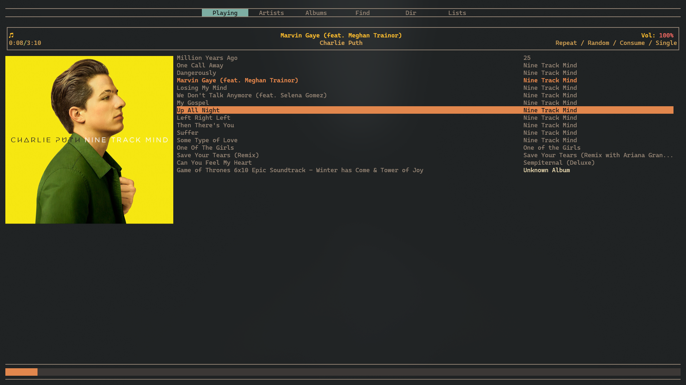

# RMPC - TUI Music Player Client

- For detailed configuration and usage: [RMPC Documentation](https://mierak.github.io/rmpc/next/overview/)

## Prerequisites

- **MPD**: Must be pre-installed and configured
- Check configuration at [`~/symphony/.config/mpd`](../mpd/)

## Installation

```bash
sudo pacman -S rmpc
```

```bash
cp -r ~/symphony/.config/rmpc ~/.config/
```


